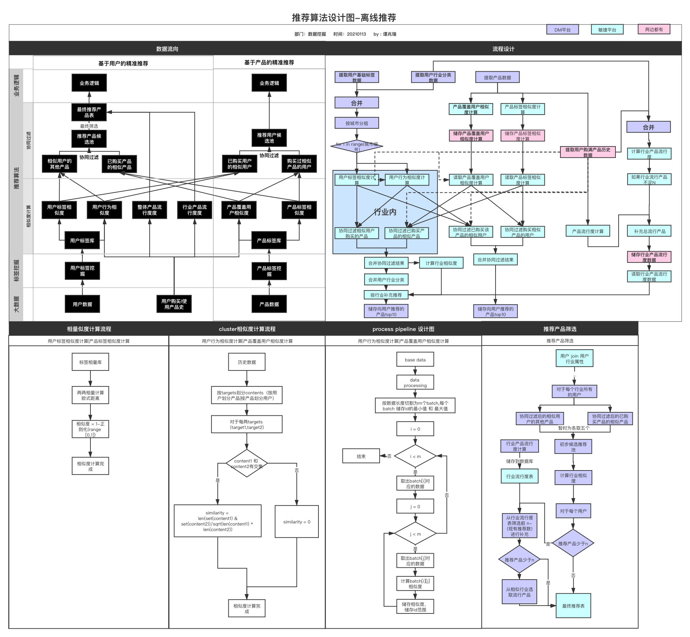

# an offline recommendation system based 一个简单的离线推荐系统

设计如图：
 

代码包含：
- 相似度
    - 欧式距离相似度
    - 余弦相似度
    - KNN
- CF（同一套代码）
    - 可基于item
    - 可基于user
- 流行度计算
    - 整体流行度计算
    - 按某一标签计算流行度
- pipeline 
    - 本地有时候跑不动，加了一个简单的pipeline
    
备注：
- 最终推荐的逻辑是按照业务逻辑来的。由于业务流程时间长，推荐结果不能及时计算准确率，所以暂时未包含。
- 因为业务需求，需要为产品推荐客户，所以代码中target代指推荐目标，content对应推荐内容，并不是单单向客户推荐产品

我个人觉得可以可优化的：
- 数据量很大的时候 
    - 可以annoy或者lhs来计算相似度
    - 相似度可以不用两两全部计算，可以随机一批数据出来与当前数据进行比较
    - 上spark
- 最终推荐
    - 可以上各种模型
